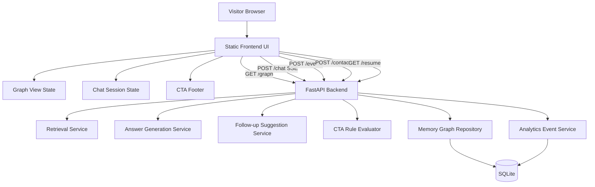
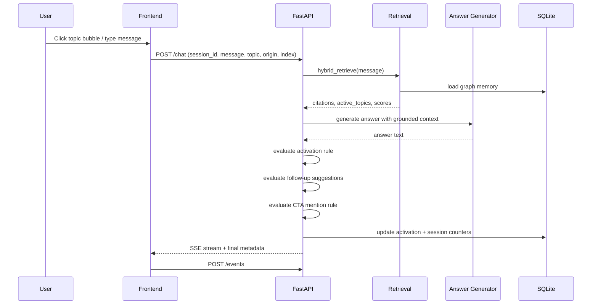

# Architecture — Interactive AI-Native Portfolio Exploration System

## 1. Purpose

This document translates [PRD.md](/Users/lyx_computer/Desktop/AgLyx3.github.io/PRD.md) and [DESIGN.md](/Users/lyx_computer/Desktop/AgLyx3.github.io/DESIGN.md) into an implementation architecture for the current codebase.

It is intentionally pragmatic:

* build on the existing FastAPI + SQLite + static frontend stack
* keep launch architecture as a modular monolith
* defer heavier infrastructure until usage proves it is needed

---

## 2. Architectural Summary

### Recommended launch architecture

**Pattern:** modular monolith with a static frontend and a single backend API.

**Why**

* the team size and project scope do not justify microservices
* the domain boundaries are still evolving
* the product needs rapid iteration on interaction quality, retrieval behavior, and analytics
* the current codebase already fits a layered modular-monolith shape

### High-level building blocks

1. **Static Frontend Experience**
   * landing graph
   * chat shell
   * topic/profile detail pages
   * CTA footer and conversion surfaces

2. **Portfolio Backend API**
   * graph read API
   * chat streaming API
   * action endpoints
   * analytics event ingest API

3. **Memory Graph Store**
   * profile memories
   * topics
   * experiences
   * relevance edges
   * activation state

4. **Inference / Retrieval Layer**
   * retrieval over portfolio memory
   * answer generation
   * follow-up suggestion generation
   * CTA mention rule evaluation

5. **Analytics Layer**
   * session tracking
   * event logging
   * funnel aggregation

---

## 3. Current-State Assessment

### Current architecture in repo

The repo already implements a workable v1 foundation:

* **Frontend**
  * static HTML pages under `frontend/`
  * graph rendered with D3 in [frontend/graph.html](/Users/lyx_computer/Desktop/AgLyx3.github.io/frontend/graph.html)
  * chat page in [frontend/chat.html](/Users/lyx_computer/Desktop/AgLyx3.github.io/frontend/chat.html)
  * topic/profile detail pages

* **Backend**
  * FastAPI app in `backend/app`
  * chat SSE endpoint in [backend/app/api/chat.py](/Users/lyx_computer/Desktop/AgLyx3.github.io/backend/app/api/chat.py)
  * graph endpoint in [backend/app/api/graph.py](/Users/lyx_computer/Desktop/AgLyx3.github.io/backend/app/api/graph.py)
  * retrieval in [backend/app/services/retrieval.py](/Users/lyx_computer/Desktop/AgLyx3.github.io/backend/app/services/retrieval.py)
  * activation updates in [backend/app/services/activation.py](/Users/lyx_computer/Desktop/AgLyx3.github.io/backend/app/services/activation.py)
  * SQLite schema/init in [backend/app/services/db.py](/Users/lyx_computer/Desktop/AgLyx3.github.io/backend/app/services/db.py)

### What already matches the PRD

* graph-led exploration exists
* topic and profile memory structures exist
* one-session chat model exists conceptually
* graph activation and weighting primitives exist
* retrieval-backed answer generation exists

### Major gaps versus PRD/DESIGN

1. landing and chat are still separate pages, not one animated state transition
2. analytics event ingestion does not exist
3. CTA logic is not implemented as a product rule system
4. follow-up suggestion generation is not yet formalized
5. privacy/session rules are not encoded explicitly
6. messaging / scheduling / resume action flows are not modeled as architecture components

---

## 4. Target System Architecture



### Architectural decision

Keep all product logic in one backend deployment, but separate it by module:

* `api`
* `application services`
* `domain rules`
* `persistence`

This gives clean boundaries without operational complexity.

---

## 5. Frontend Architecture

## 5.1 Frontend pattern

**Pattern:** stateful static client with server-backed data/actions.

Use plain HTML/CSS/JS pages for launch, but treat them as one product surface with shared state conventions.

### Recommended frontend states

1. **Landing State**
   * full-screen graph
   * centered identity block
   * input bar
   * no heavyweight chrome

2. **Chat State**
   * graph pushed outward
   * centered conversation panel
   * CTA footer always visible

3. **Topic / Profile Deep Dive State**
   * detail pages for structured browsing

### Frontend modules

* `GraphRenderer`
  * D3 simulation
  * hover/focus animation
  * active/visited topic rendering

* `ComposerController`
  * prefill behavior
  * manual send
  * message count tracking

* `ChatThreadController`
  * SSE stream consumption
  * message rendering
  * follow-up chip rendering

* `SessionStore`
  * ephemeral browser-side session ID
  * current message count
  * active topic
  * whether in-chat CTA was already mentioned

* `AnalyticsClient`
  * emits event payloads to backend

### Frontend state model

```text
session_id
current_mode            = landing | chat | topic | profile
active_topic_id         = nullable
prefill_origin          = manual | topic_prefill | suggestion_question | suggestion_topic
message_count           = integer
visited_topics          = set
cta_mentioned           = boolean
cta_rejected            = boolean
```

### Why not a frontend framework yet

* page count is small
* interaction complexity is moderate, not yet large enough to justify framework migration cost
* current code already works as static HTML/JS

If the landing-to-chat animation and state handling become too complex, the first upgrade path should be **one small SPA shell**, not a full architecture rewrite.

---

## 6. Backend Architecture

## 6.1 Backend pattern

**Pattern:** layered FastAPI monolith.

### Layers

1. **API layer**
   * request/response contracts
   * streaming endpoints
   * action endpoints

2. **Application services**
   * orchestration of retrieval, answer generation, analytics, and persistence

3. **Domain rule layer**
   * activation policy
   * CTA mention rules
   * follow-up generation limits
   * message-depth milestone logic

4. **Persistence layer**
   * SQLite repositories

### Recommended backend modules

```text
app/api/
  chat.py
  graph.py
  actions.py         # new
  analytics.py       # new

app/services/
  retrieval.py
  llm.py
  activation.py
  followups.py       # new
  cta_rules.py       # new
  analytics.py       # new
  session.py         # new
  contact.py         # new

app/repositories/    # recommended future refactor
  graph_repo.py
  analytics_repo.py
  session_repo.py
```

### Core backend APIs

#### 1. `GET /graph`
Returns:

* profile memory records
* topic nodes
* graph metadata needed by landing/chat UI

#### 2. `POST /chat`
Current behavior is SSE token streaming. Keep that.

Enhance request contract to include:

* `session_id`
* `message`
* `active_topic_id`
* `prefill_origin`
* `message_index`

Enhance final metadata to include:

* `active_topics`
* `citations`
* `follow_up_questions`
* `adjacent_topics`
* `cta_mention`

#### 3. `POST /events`
New analytics ingest endpoint for client events.

#### 4. `POST /contact`
Handles send-message flow.

#### 5. `GET /resume`
Serves resume asset and records download event.

#### 6. `GET /schedule-link`
Returns or redirects to scheduling URL and records action event.

---

## 7. Data Architecture

## 7.1 Core launch data model

Keep SQLite for launch.

### Existing entities

* `profile_memories`
* `topics`
* `experiences`
* `relevance_edges`
* `memory_query_gaps`

### New recommended entities

#### `analytics_events`

```text
event_id              INTEGER PK
session_id            TEXT NOT NULL
event_name            TEXT NOT NULL
event_payload_json    TEXT NOT NULL
created_at            TEXT NOT NULL
```

#### `sessions`

Used only for lightweight current-session analytics and CTA state, not full transcript history.

```text
session_id            TEXT PK
started_at            TEXT NOT NULL
last_seen_at          TEXT NOT NULL
message_count         INTEGER NOT NULL DEFAULT 0
first_message_at      TEXT
depth_5_reached_at    TEXT
cta_mentioned         INTEGER NOT NULL DEFAULT 0
cta_rejected          INTEGER NOT NULL DEFAULT 0
active_topic_id       TEXT
```

#### `outbound_messages`

```text
message_id            INTEGER PK
session_id            TEXT NOT NULL
message_body          TEXT NOT NULL
included_chat_history INTEGER NOT NULL DEFAULT 0
conversation_json     TEXT
created_at            TEXT NOT NULL
delivery_status       TEXT NOT NULL
```

### Important privacy rule

Per PRD:

* do **not** persist full session history by default
* keep only lightweight session state and analytics
* persist conversation transcript only when user explicitly includes it in a message to Yixin

---

## 8. Chat and Retrieval Flow



### Launch answer pipeline

1. receive message
2. sanitize
3. retrieve top portfolio experiences
4. decide whether memory confidence is sufficient
5. generate grounded answer
6. produce up to:
   * 3 adjacent questions
   * or 3 adjacent topics
7. evaluate whether in-chat CTA may be mentioned
8. update activation and session state
9. stream answer + final metadata

### Required behavior from PRD

If memory confidence is weak:

> I am not sure about this based on my memory about Yixin. Wanna ask something different?

This should become a backend-controlled fallback, not only prompt-level behavior.

---

## 9. CTA Architecture

## 9.1 Footer CTA system

Always visible in UI:

* LinkedIn
* Send Message
* Download Resume
* Schedule Time

These are **presentation-level CTAs**, not inference-dependent CTAs.

## 9.2 In-chat CTA mention system

This is a rules engine, not an LLM guess.

### Rule inputs

* `message_count`
* `cta_mentioned`
* `cta_rejected`
* explicit user intent in latest message

### Rule outputs

* `none`
* `linkedin`
* `send_message`
* `download_resume`
* `schedule_time`

### Launch rule set

1. if `cta_mentioned = true`, return `none`
2. if `cta_rejected = true`, return `none`
3. if user explicitly asks for next steps / resume / scheduling / contact, allow one relevant CTA
4. else if `message_count >= 5`, allow one relevant CTA after the answer
5. otherwise return `none`

This rule set must be coded in `cta_rules.py`, not buried in prompts.

---

## 10. Analytics Architecture

The PRD metrics require first-class event logging.

## 10.1 Required events

Implement the events already defined in [PRD.md](/Users/lyx_computer/Desktop/AgLyx3.github.io/PRD.md):

* `topic_prefill_clicked`
* `chat_first_message_sent`
* `chat_message_sent`
* `chat_depth_reached`
* `cta_footer_clicked`
* `message_sent_to_yixin`
* `resume_download_started`
* `linkedin_profile_opened`
* `schedule_time_opened`

## 10.2 Tracking strategy

### Frontend responsibility

Emit user-intent and UI interaction events:

* topic click
* prefill
* first message
* CTA click

### Backend responsibility

Emit system-truth events:

* accepted chat message
* depth milestone reached
* actual outbound message send
* resume download initiated

### Why split this way

Frontend can observe intent.
Backend should authoritatively record committed actions.

---

## 11. Design-System Architecture Implications

The design is not purely cosmetic; it imposes technical constraints.

### From DESIGN.md

1. **Landing and chat are two states of one system**
   * architecture should not assume graph page and chat page remain independent forever

2. **Bubble physics are core identity**
   * graph simulation is a platform component, not a decorative widget

3. **Chat panel overlays the graph**
   * UI architecture should preserve shared graph state across interaction states

### Recommended interpretation

For launch, keep separate pages if needed.
For the next implementation milestone, move to:

* one `experience shell` page
* graph background layer
* chat panel layer
* details drawer/page routing on top

This is the cleanest way to satisfy the design without overengineering the backend.

---

## 12. Recommended File and Module Changes

## 12.1 Backend

### Add

* `backend/app/api/analytics.py`
* `backend/app/api/actions.py`
* `backend/app/services/analytics.py`
* `backend/app/services/cta_rules.py`
* `backend/app/services/followups.py`
* `backend/app/services/session.py`
* optional repository split under `backend/app/repositories/`

### Modify

* [backend/app/api/chat.py](/Users/lyx_computer/Desktop/AgLyx3.github.io/backend/app/api/chat.py)
  * add follow-up generation
  * add CTA rule output
  * add session milestone updates

* [backend/app/services/db.py](/Users/lyx_computer/Desktop/AgLyx3.github.io/backend/app/services/db.py)
  * add analytics/session/action tables

* [backend/app/models/chat.py](/Users/lyx_computer/Desktop/AgLyx3.github.io/backend/app/models/chat.py)
  * extend request/response metadata

## 12.2 Frontend

### Add or consolidate

* unified session-state helper in `frontend/assets/app.js` or a new module
* analytics client helper
* CTA interaction tracking helper

### Modify

* [frontend/graph.html](/Users/lyx_computer/Desktop/AgLyx3.github.io/frontend/graph.html)
  * emit topic-prefill analytics
  * store active topic in session state

* [frontend/chat.html](/Users/lyx_computer/Desktop/AgLyx3.github.io/frontend/chat.html)
  * send enriched chat payload
  * track message counts
  * render follow-up suggestions from backend metadata
  * enforce one-time in-chat CTA behavior visually

---

## 13. Phased Implementation Plan

## Phase 1 — Product-Correct Backend

Goal: make current flows behave according to PRD.

Deliver:

* session state table
* analytics event ingest
* explicit CTA rule service
* follow-up metadata generation
* weak-memory fallback behavior
* action endpoints for message / resume / schedule / LinkedIn tracking

## Phase 2 — Frontend Session Cohesion

Goal: make graph and chat feel like one product.

Deliver:

* shared session ID in browser
* topic prefill analytics
* follow-up chip handling
* CTA footer tracking
* active-topic and visited-topic visual states

## Phase 3 — Landing-to-Chat Unified Shell

Goal: satisfy the stronger DESIGN.md interaction model.

Deliver:

* one-page landing/chat transition
* graph-to-side-column animation
* centered glass chat panel
* persistent bubble simulation across states

This phase is a frontend architecture upgrade, not a backend rewrite.

---

## 14. Non-Goals for Launch

Do not build yet:

* microservices
* account system
* long-term visitor memory
* persistent transcript storage by default
* vector database
* agent orchestration
* real-time multi-user systems

These add complexity without improving the launch outcome.

---

## 15. Key Architecture Decisions

### ADR-1: Modular monolith over microservices

**Decision:** use one FastAPI app and one SQLite DB for launch.

**Reason:** domain is still changing; ops complexity would be wasteful.

### ADR-2: SQLite for launch persistence

**Decision:** keep SQLite for memory graph, session state, analytics events, and action logging.

**Reason:** low traffic, simple deployment, easy local iteration.

**Upgrade trigger:** move to Postgres when event volume, concurrency, or operational reporting outgrows SQLite.

### ADR-3: Rules-based CTA surfacing

**Decision:** CTA mention logic is explicit application logic, not LLM-only behavior.

**Reason:** product behavior must be testable and deterministic.

### ADR-4: Ephemeral session history by default

**Decision:** do not persist transcript history unless user explicitly includes it in a sent message.

**Reason:** aligns with PRD privacy intent and keeps data handling simple.

### ADR-5: Graph simulation as a first-class frontend subsystem

**Decision:** treat bubble graph logic as a reusable product module.

**Reason:** graph behavior is central to identity, onboarding, and navigation.

---

## 16. Launch Readiness Checklist

Before launch, the system should satisfy:

* topic click prefill is tracked
* first message is tracked
* 5-message milestone is tracked
* action completions are tracked
* in-chat CTA mention can happen only once
* rejected CTA is not repeated in session
* weak-memory fallback is deterministic
* no transcript is persisted unless explicitly included in send-message flow
* graph, chat, and CTA layers all use the same session ID

---

## 17. Final Recommendation

Do **not** redesign the platform as a distributed system.

Build the product as:

* a **stateful frontend experience**
* on top of a **modular FastAPI monolith**
* backed by a **single SQLite memory + analytics store**

That is the fastest architecture that still cleanly supports:

* graph-led onboarding
* persistent in-session exploration
* retrieval-grounded chat
* one-time CTA surfacing
* event-based product measurement

The next real architecture breakpoint is not backend scale. It is the frontend move from separate pages to a unified landing/chat shell.
